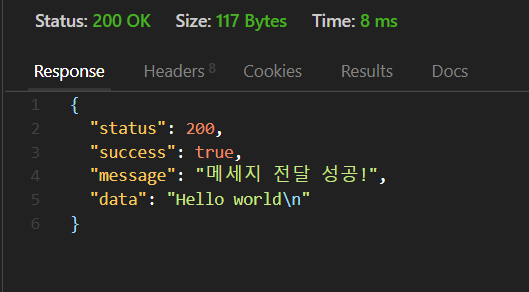
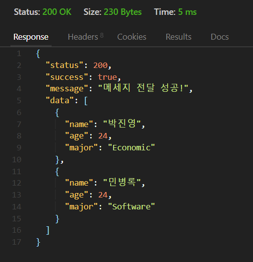
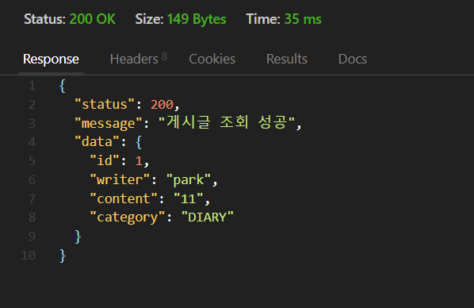
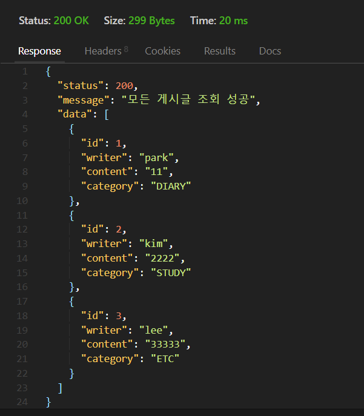
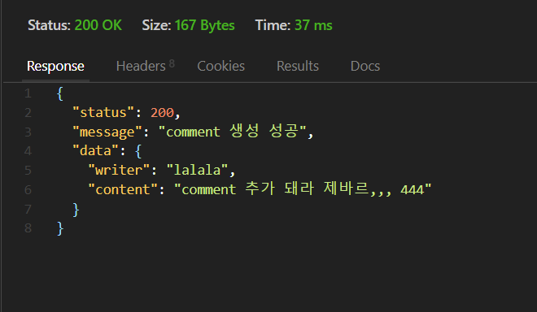
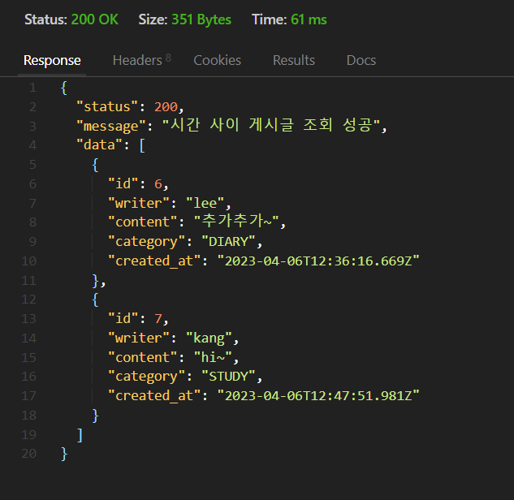
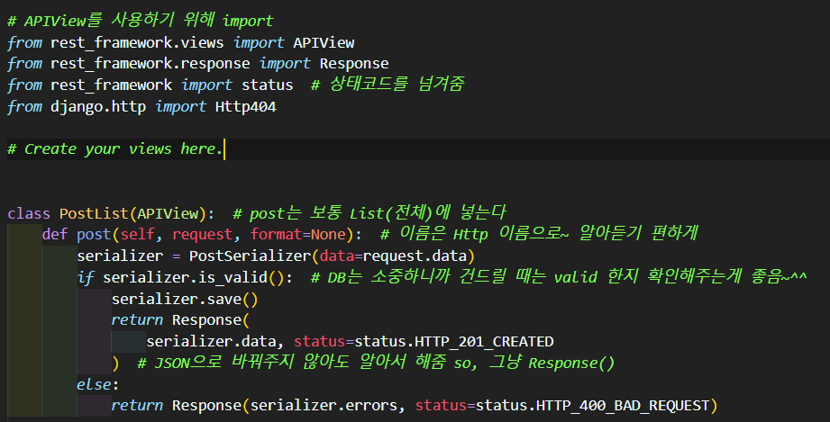
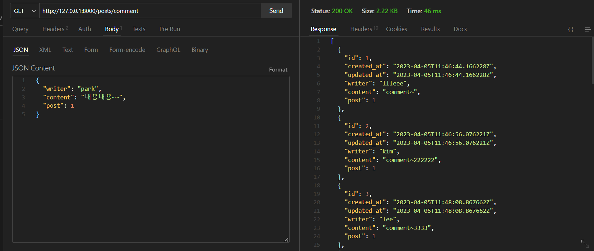
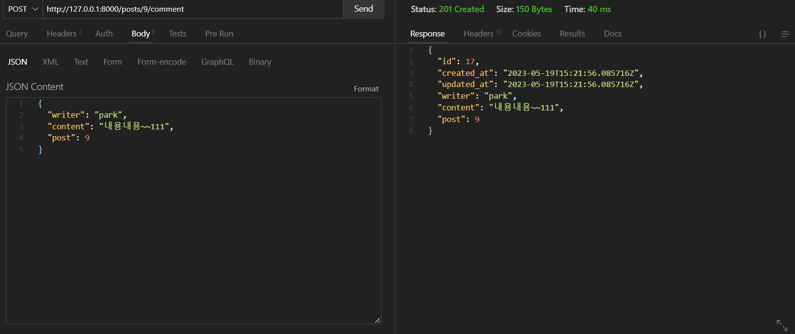

# 안녕하세요

- Likelion 11th in CAU
- COMP 36th
- ECON / SOFTWARE

<h3> What i want to study </h3>

	</a>
	</a>			
 

	
	</a>
 

	
 

	
 

	
	
	
---

### 첫 번째 과제 다들 화이팅...

 
 
 

<h3>Week 3</h3>
  

  

  
<h3>Week 4</h3>
  

  

  
<h3>Week 5</h3>
  

  

  
<h3>Week 8</h3>
  

  

  

  
<h3>Week 9</h3>
  

  

  

  

